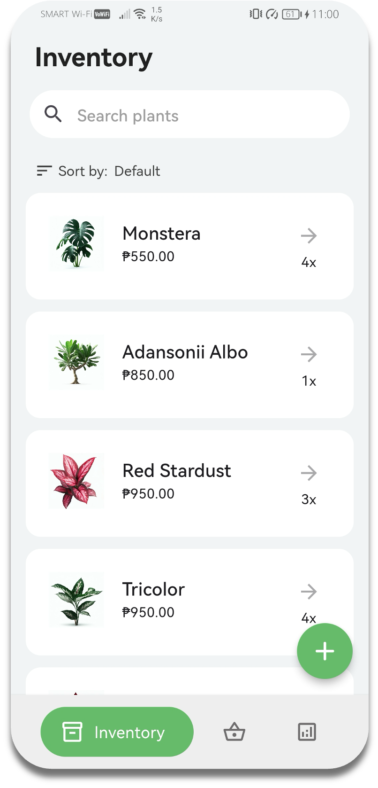
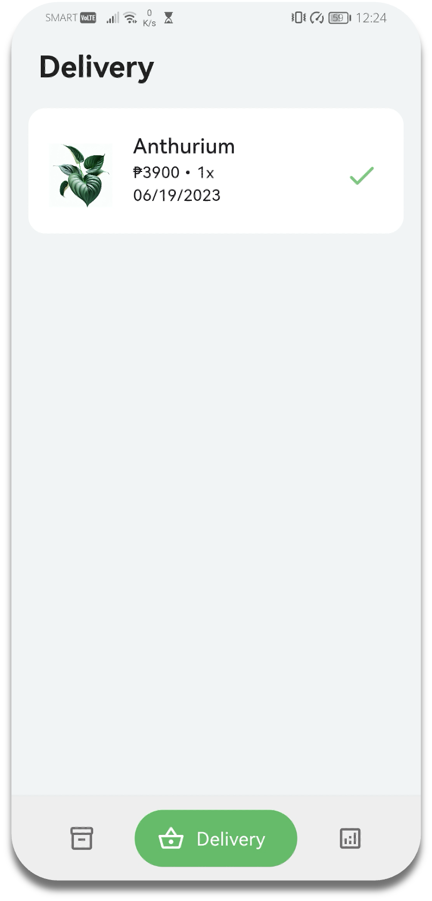
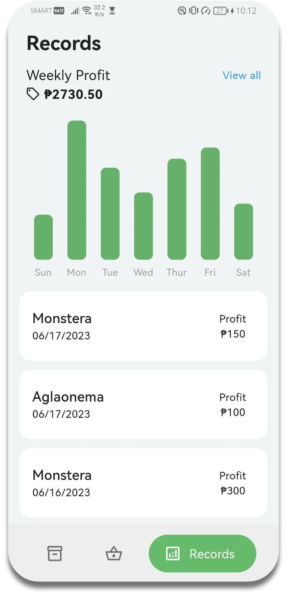

# Plantdemic

`Overview`

It all started with the pandemic, as lockdown measures were imposed worldwide. During this time, people found themselves with more free time and a desire to explore new hobbies. 

The lockdown has sparked a widespread interest in gardening among Filipinos, becoming popular in both rural and urban areas.This newfound passion for gardening is reflected in the terms "plantito" for males and "plantita" for females, which refer to individuals who take pleasure in cultivating and nurturing plants, as noted by Sunga (2021). 

One such hobby that gained significant popularity, especially among our parents, is taking care of plants. They have affectionately been referred to as 'plantitos' for males and 'plantitas' for females.

Before the pandemic, my mother had always been passionate about growing and nurturing plants. She found joy in attending to her garden and watching her plants flourish. Little did my mother know that the arrival of the pandemic would lead to a significant boom in the plant industry. 

It was during this time that my mother saw an opportunity to turn her passion into a business. With her green thumb and knowledge of plants, she started cultivating a wide variety of plant species and offering them for sale. However, as my mother's plant business grew, so did the challenges of managing it effectively. She relied on manual methods to keep track of her inventory, prices, and profits. This involved writing down plant names, prices, and other details on paper, which was time-consuming and prone to errors. Upon recognizing this, I made the decision to develop an application that would address these challenges.

`Plantdemic`

Plantdemic is a mobile application developed for plant business owners to provide a comprehensive and a user-friendly financial management system for its users, with the aim of streamlining plant-related transactions and increasing profitability.

`Features`

- Inventory
- Delivery
- Reports

  

